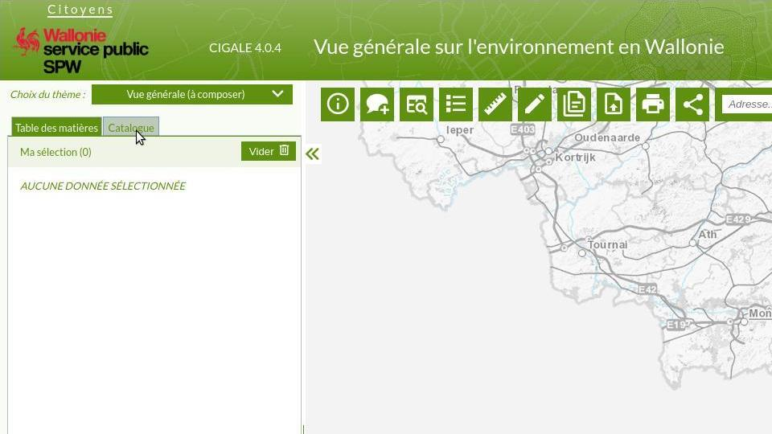
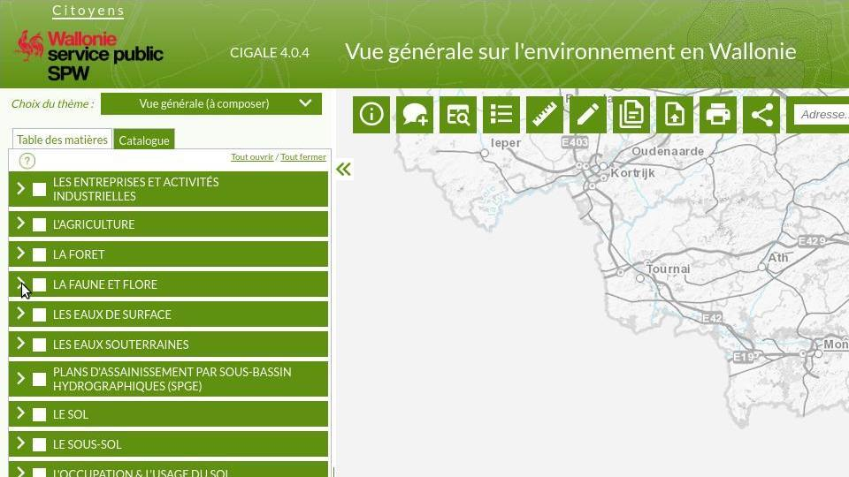
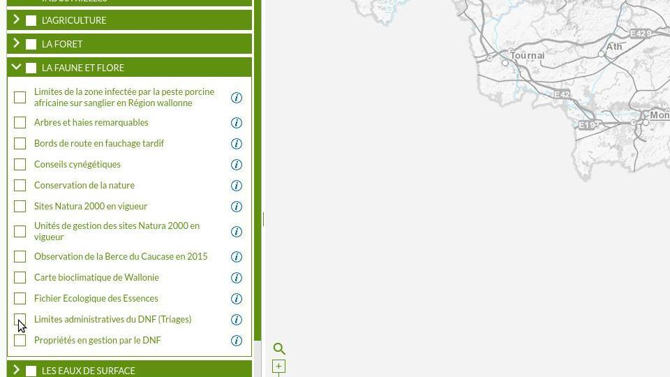
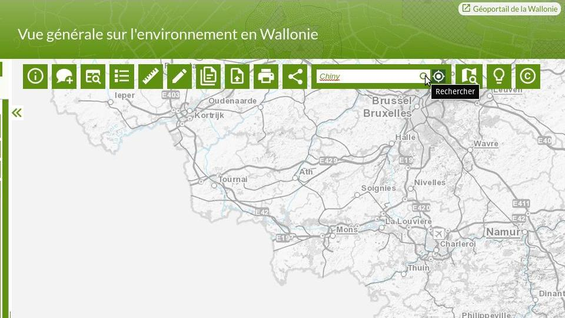
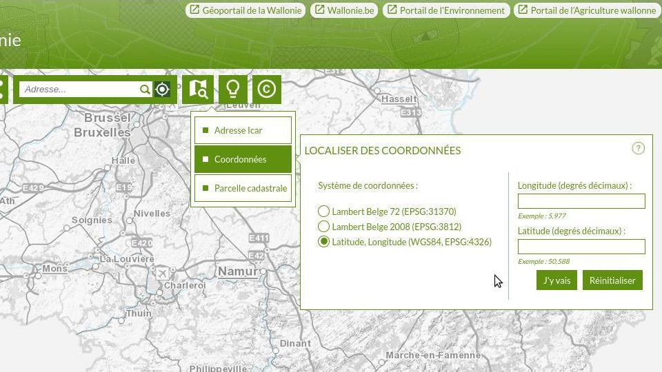
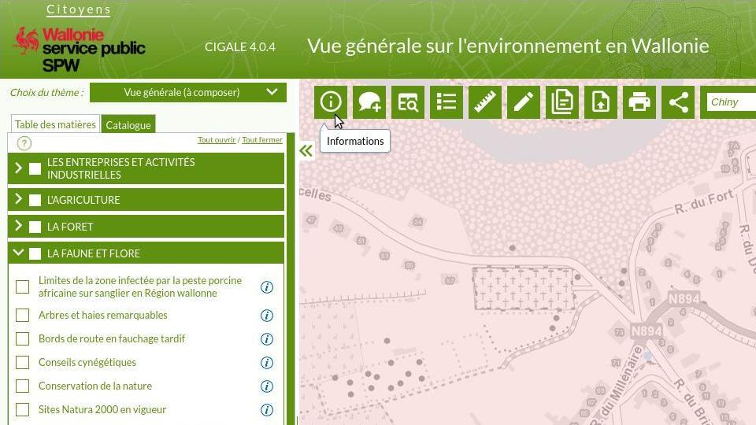
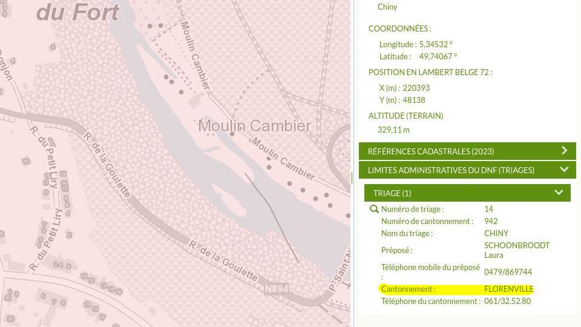
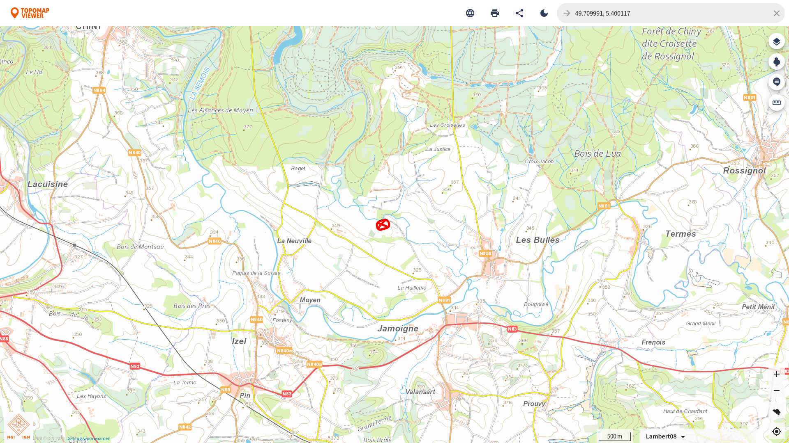
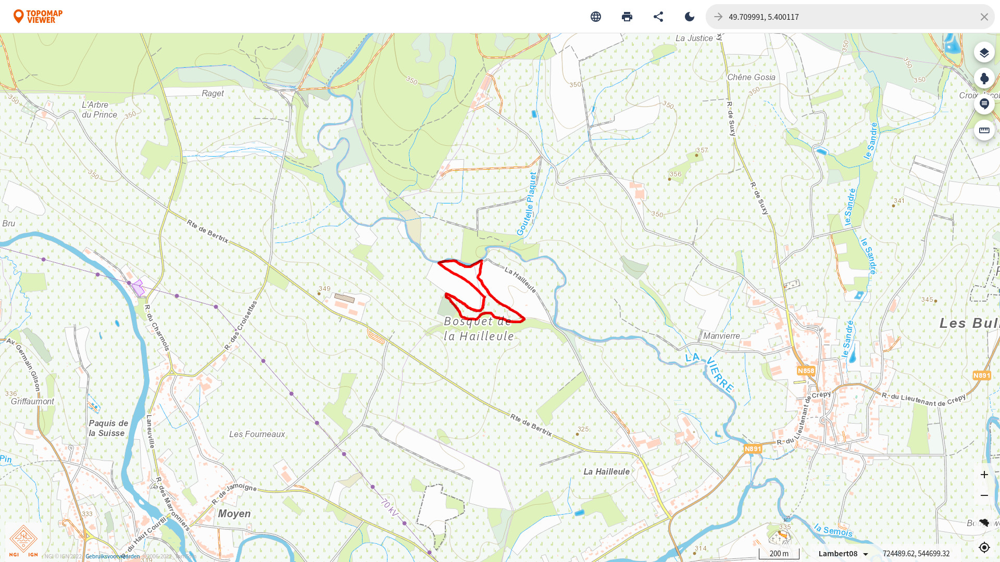

# Bosaanvraag

::: tip
Sinds maart 2023 is er een **nieuwe online manier** om de bosaanvragen te doen. Op [deze pagina](https://www.wallonie.be/fr/demarches/demander-une-autorisation-pour-organiser-une-activite-dans-une-zone-dacces-libre-en-foret#) staat de volledige uitleg.
:::

::: tip
Dit artikel is gebaseerd op een outdated [artikel van Opkamp.be](https://www.opkamp.be/toelatingen-wallonie).
:::

## Waarom en Hoe

Om te mogen spelen en/of hout te sprokkelen in Waalse bossen dient men een aanvraag in te dienen bij het departement van natuur en bos (DNF). Meestal bezorgen zij je dan een kaartje van de omgeving en wat wel en niet mag in de bossen in dat gebied.

De aanvraag moet **voor 1 mei** naar het plaatselijke bosbeheer van het juist cantonnement gestuurd worden.

::: tip
Kijk zeker naar de aanvragen van vorige jaren om mogelijks wat werk te besparen.
:::

[[toc]]

## Cantonnement bepalen

Om te weten naar welk adres we de aanvraag moeten sturen moeten we eerst bepalen in welk cantonnement ons kampterrein zig bevindt.

Het cantonnement voor enkele van onze favoriete terreinen:

* Dourbes: Viroinval
* Chiny: Florenville

### Open de GIS-kaart

Open de [GIS-kaart](http://geoapps.wallonie.be/Cigale/Public).

### Schakel de laag `Limites administratives du DNF` in

Selecteer de laag via `Catalogue` > `LA FAUNE ET FLORE` > `Limites administratives du DNF (Triangles)`.

::: details Screenshots

:::

### Zoek het kampterrein

Zoek de locatie van het terrein via de zoekbalk of via coordinaten.

::: details Screenshots

:::

### Cantonnement bepalen

Druk op de `info`-knop (er verschijnt een paneel aan de rechterkant) en druk vervolgens op de locatie van het kampterrein. In het paneel zien we nu onder `Limites administratives du DNF` wat het cantonnement is.

::: details Screenshots

:::

## Kampterrein aanduiden op een kaart

Als de locatie geen adres heeft (zoals een kampterrein) moet men ook een kaartje doorsturen waarop het terrein is aangeduid. Deze kaart moet op schaal 1/20.000 of 25.000 zijn.

### Kaartje zoeken

Open [deze kaart](https://topomapviewer.ngi.be/), en zoek het kampterrein. Aangezien deze digitale kaart niet met schaal 1/20.000 of 25.000 werkt, raad ik aan om een screenshot te maken waarbij de schaal op `200m` staat en een andere waarbij de schaal `500m` staat.

### Kampterrein aanduiden

Duid in een programma naar keuze het kampterrein aan op de screenshots.

::: details Screenshots
Voorbeeld: Chiny

:::

## Aanvraag versturen

Download [dit formulier](https://www.opkamp.be/sites/default/files/aanvraagformulierDNF.doc) (link van Opkamp.be) en vul het in.

Zoek in [deze adreslijst](http://environnement.wallonie.be/dnf/servext/adsednf.htm) het juiste mailadres en stuur het ingevulde formulier en de kaartjes door.
